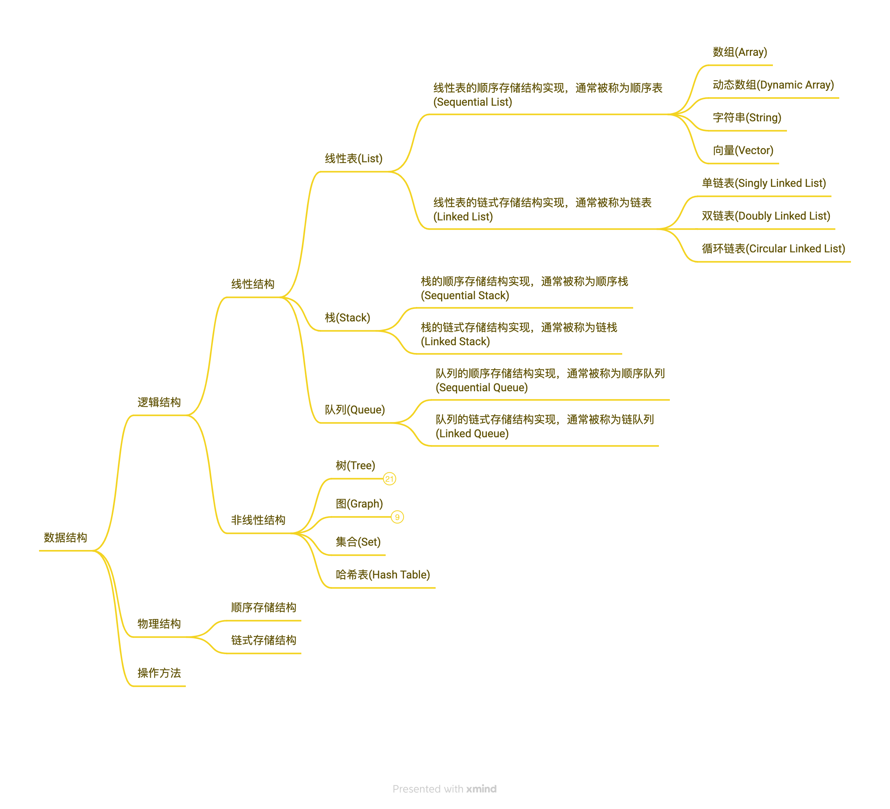

# 数据结构



## 什么是数据结构

```
数据结构 = 逻辑结构 + 物理结构 + 操作方法
```

数据结构是关于如何组织数据元素、如何存储数据元素和如何操作数据元素的。

数据元素的组织形式，即逻辑结构，有

* 线性结构
    * 线性表(List)
    * 栈(Stack)
    * 队列(Queue)
* 非线性结构
    * 树(Tree)
    * 图(Graph)
    * 集合(Set)
    * 哈希表(Hash Table)

数据元素的存储形式，即物理结构，又叫存储结构，有

* 顺序存储结构：数据元素存储在连续的内存单元中
* 链式存储结构：数据元素存储在任意的内存单元中

## 抽象数据类型(Abstract Data Type，ADT)

```
抽象数据类型 = 逻辑结构 + 操作方法的接口
```

数据结构是抽象数据类型的实现

```
数据结构 = 抽象数据类型 + 实现(物理结构 + 操作方法的实现)
```

在编程语言中实现的数据结构，也是一种数据类型，叫结构类型。
