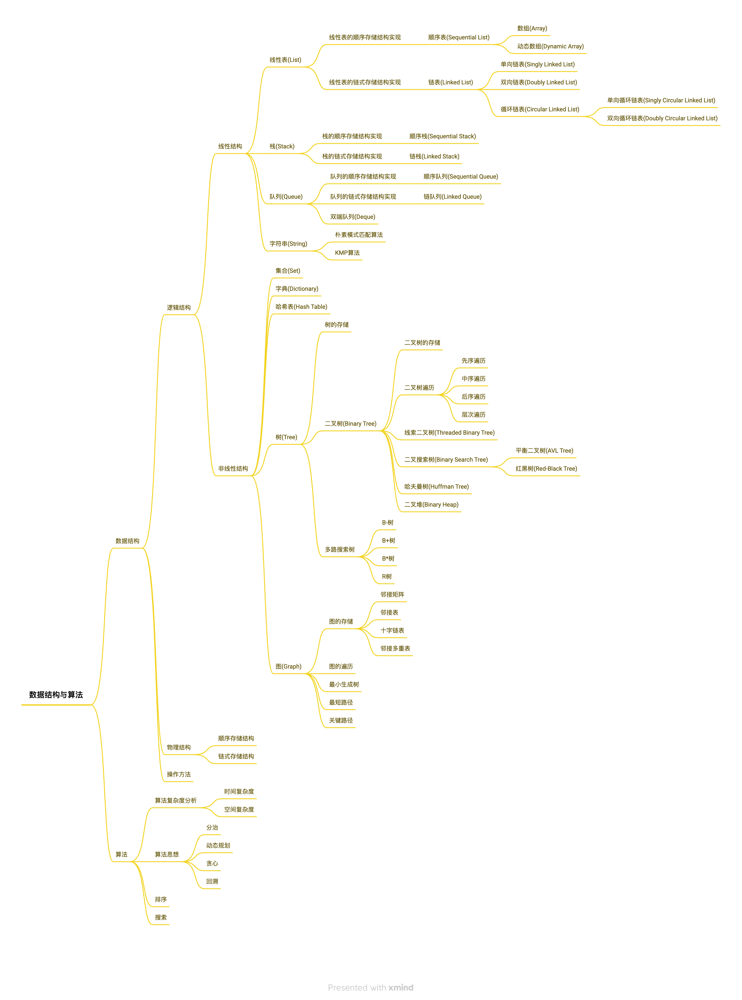

# 概览



## 什么是数据结构？什么是算法？

```
数据结构 = 逻辑结构 + 物理结构 + 操作方法
```

如何组织数据元素？如何存储数据元素？如何操作数据元素？

这是数据结构关心的三个问题。

数据元素的组织形式，称为`逻辑结构`。

数据元素的存储形式，称为`物理结`构，又叫`存储结构`。

操作数据元素的步骤，就是`算法`。

## 数据结构和算法为什么总在一起出现？

```
程序 = 数据结构 + 算法
```

数据结构像个植物人，什么都有，但是什么事都不能干，有了算法，才有了灵魂，才可以喜怒哀乐，说学逗唱。

## 什么是抽象数据类型(Abstract Data Type，ADT)

可以用抽象数据类型来描述数据结构

```
抽象数据类型 = 逻辑结构 + 操作方法的接口
```

数据结构是抽象数据类型的实现

```
数据结构 = 抽象数据类型 + 实现(物理结构 + 操作方法的实现)
```

因此，在编程语言中实现的数据结构，也是一种数据类型，叫结构类型。
